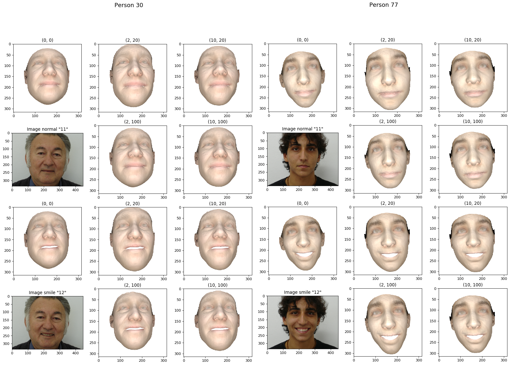

# Convex Hull Escape Perturbation at Embedding Space and Spherical Bins Coloring for 3D Face De-identification

## Folder Structure

    .  
    ├──/cpp_codes (to create shape by using perturbed alphas)
    └──/py_codes    
         ├──/alphas (to create and perturb alphas by using CHEP)
         ├──/demoCode (to create shape by using alphas)
         ├──/projection_2D (to do SBC for color reinstatement and 2D project etc.)
         └──/evaluation (to do identity classification)

## Setup of C++ Code in Docker container

1. Do the setup for [Extreme 3D Reconstruction][1], download the Bump-CNN model, BFM model, dlib face prediction model etc. and put in the respective folder as instructed in the readme file of Extreme 3D Reconstruction
2. Use the `FaceServices2.cpp` of this repo to replace the one in `/extreme_3d_faces/modules/PoseExpr/src/FaceServices2.cpp` . The modified code (lines 766 - 812, and lines 53 - 83) will extract the perturbed alpha files (which are generated by the Python codes) to replace the original alpha. You may want to modify `FaceServices2.cpp` further if the location of alpha files are at somewhere else.
3. Compile the C++ codes as instructed by the Extreme 3D Reconstruction

## Setup of Python Code in Docker container

1. Place the `/alphas` directory (and files inside) as the `/demoCode/alphas` directory in the Docker container. Note that the files inside `/alphas/FEI` are in fact the output files generated by `/alphas/create_alphas_from_database.py` and `/alphas/perturbation.py`
2. Place the files inside `/demoCode` in `/demoCode` in the Docker container

## Procedures

**At Docket container**
1. Download the [FEI images][2] and place the 4 `originalimages_partX` folders inside `/shared/input/FEI_Face_Database`
2. Run `/alphas/create_alphas_from_database.py` to embed FEI images into non-perturbed alphas and stored in the `.npy` files
3. Run `/alphas/perturbation.py` to generate the perturbed alphas and the `.alpha` files
4. Run the `/demoCode/testBatchModel.py` (which will call the C++ code) to generate the perturbed 3D faces with wrinkles (i.e. `.ply` files) using 5 different perturbation approach. e.g. `> python testBatchModel.py testImages_180_normal.txt /shared/output/output_180_normal_PB/pb2_pivot20`.
5. To get the non-perturbed face, use the original `FaceServices2.cpp` of Extreme 3D Reconstruction (i.e. not the modified one), re-compile the C++ code, and then run `/demoCode/testBatchModel.py` again.

**Copy files from Docker Container to host Machine**
1. Copy the `.ply` output from Docker Container to `your_path/output/output_180_normal_initial`, `your_path/output/output_180_normal_prePB` and `your_path/output/output_180_normal_PB/pbX_pivotX` (4 folders) at your host machine
2. Copy the `/shared/input/FEI_Face_Database` from Docker Container to `your_path/input/FEI_Face_Database`
3. Suggest to share folder between the Docker container and the host machine so that the above copy & paste are not required
4. Download `facenet_keras.h5` and `facenet_keras_weights.h5` from [FaceNet's folder][3] and put them inside `your_path/output/facenet` in host machine

**At host**
1. Run `/projection_2D/list_generation.py` to generate the list `inputList_180_normal_smile.txt`
2. Run `/projection_2D/colored_2D.py` to reinstate color, and project the 3D faces onto the 2D images as `.png` files
3. Run `/projection_2D/visualize_2D_images.py` to review result 2D images of the selected individuals
4. If needed, use `random_rot_vector()` of `/projection_2D/rotate_resize_3D.py` to generate a new list of random rotation, i.e. `rotation.npy`
5. Run `/evaluation/embed_2d.py` to embed the 2D images as FaceNet embeddings, i.e. a single `.npz` file for each directory
6. Move the `.npz` files to the directory `/evaluation/embeddings_FaceNet`. There are some previous output there. rename the files in similar format
7. Run `/evaluation/classification.py` to get the final result

[1]: https://github.com/anhttran/extreme_3d_faces
[2]: https://fei.edu.br/~cet/facedatabase.html
[3]: https://drive.google.com/drive/folders/1pwQ3H4aJ8a6yyJHZkTwtjcL4wYWQb7bn
